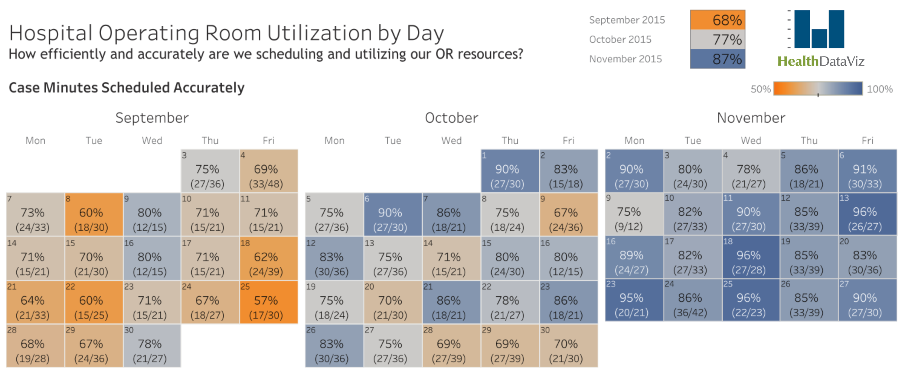

# Assignment 4

<table>
  <tr>
    <td style="text-align:right"> Given date :
    <td> May 21st, 2025
  <tr>
    <td style="text-align:right"> Due date :
    <td> May 26th, 2025, 23:59 WITA
</table>

> Please open this markdown in VSCode with GitHub Markdown Preview to render all the HTML, and use a light theme.

Ilham Ahmad Fahriji (10231042)

You may answer in English or Bahasa Indonesia. If you insert images into your markdown file, please use a relative path and submit your work as a `.zip` archive.

You may use ChatGPT, but be aware that it may provide incorrect or hallucinated answers. The point of learning is to understand what you write. If you do not understand your own answer, this assignment is **useless**.

## Problem 1 (70 points)

In this assignment, your task is to break down all the components of the following dashboard:



First, you need to manually create the data from the given image. There are three months shown in the dashboard. Store all the numbers in `room-utilization.json`.

You can use the following format:

```csv
Date,accurate_case,total_case
2015-Sep-3,27,36
2015-Sep-4,33,48
2015-Sep-7,24,33
...
2015-Nov-27,27,30
```

The two numbers in parentheses are the accurate cases and total cases. The percentage for each date is calculated as the ratio of accurate cases to total cases. You can search for the HealthDataViz logo on Google and place it at the top right.

Determine the color scale. The domain starts from 50% up to 100%.

To solve this problem, you can use either D3.js or the React framework.

Build the dashboard as close to the original as possible.

## Problem 2 (30 points)

Visit the following updated version of the dashboard above on [Tableau Public](https://public.tableau.com/app/profile/healthdataviz/viz/HealthDataViz-HospitalORUtilization_16135821834160/ORUtilizationCalendarDetails). Add a data selector using a dropdown list to select between data for (2015-Sep, 2015-Oct, 2015-Nov) and (2021-Jan, 2021-Feb, 2021-Mar). In the 2021 dataset, the total cases are not given directly, so you need to explore each date and sum all the cases.

## Answer

# Problem 1 & Problem 2

For the explanation here, I combined the solutions for Problem 1 and Problem 2 into a single codebase. However, the code for Problem 1 is located in `app.js` and is commented for clarity.

# Hospital Operating Room Utilization Dashboard (React + D3)

This is a React dashboard for visualizing hospital operating room utilization by day, supporting data selection for 2015 and 2021.  
It uses a dropdown to select the month/year and displays a color-coded heatmap calendar.

---

## 🚀 Installation & Usage
Before starting, you can clone my source code from GitHub, as the zipped project is too large to upload directly.  

1. **Clone the repository:**

  ```bash
  git clone https://github.com/itshzlnust/room-utilization-dashboard.git
  cd room-utilization-dashboard
  ```

2. **Install dependencies:**

Open your terminal in the project directory and run:

```bash
npm install
npm install d3
```

3. **Add your data files:**

- Place `room-utilization.json` (2015 data) and `room-utilization-2021.json` (2021 data) in the `public` folder.
- Also add `healthdataviz-logo.png` to the `public` folder.

4. **Start the development server:**

```bash
npm start
```

This will open the dashboard in your web browser.

5. **Interact with the dashboard:**

- Use the dropdown menu to select a month/year.
- The heatmap calendar will update to show the selected data.

## 📁 File: `src/App.js`

this is the file structure that I added to work on problem 1 and 2

```
room-utilization-dashboard/
│
├── public/
│   ├── room-utilization.json         # Data untuk tahun 2015
│   ├── room-utilization-2021.json    # Data untuk tahun 2021
│   └── healthdataviz-logo.png        # Gambar logo HealthDataViz
│
└── src/
  └── App.js                       # Komponen utama React (dashboard)
```

```javascript
import React, { useEffect, useState } from "react";
import * as d3 from "d3";

const options = [
  { label: "2015-Sep", year: 2015, month: "Sep" },
  { label: "2015-Oct", year: 2015, month: "Oct" },
  { label: "2015-Nov", year: 2015, month: "Nov" },
  { label: "2021-Jan", year: 2021, month: "Jan" },
  { label: "2021-Feb", year: 2021, month: "Feb" },
  { label: "2021-Mar", year: 2021, month: "Mar" },
];

const days = ["Mon", "Tue", "Wed", "Thu", "Fri"];

function getDayOfWeek(dateStr) {
  const [year, mon, day] = dateStr.split("-");
  const date = new Date(`${year}-${mon}-${day}`);
  return (date.getDay() + 6) % 7; // Mon=0, Fri=4
}
function getWeekOfMonth(dateStr) {
  const [year, mon, day] = dateStr.split("-");
  const date = new Date(`${year}-${mon}-${day}`);
  const first = new Date(date.getFullYear(), date.getMonth(), 1);
  return Math.floor((date.getDate() + first.getDay() - 2) / 7);
}

export default function App() {
  const [selected, setSelected] = useState(options[0]);
  const [data, setData] = useState([]);

  useEffect(() => {
    if (selected.year === 2015) {
      d3.json(process.env.PUBLIC_URL + "/room-utilization.json").then((raw) => {
        const monthKey = `-${selected.month}-`;
        setData(raw.filter((d) => d.Date.includes(monthKey)));
      });
    } else {
      d3.json(process.env.PUBLIC_URL + "/room-utilization-2021.json").then(
        (raw) => {
          const monthKey = `-${selected.month}-`;
          const filtered = raw.filter((d) => d.Date.includes(monthKey));
          // If there are multiple entries per date, sum them (your data is already summed)
          const grouped = {};
          filtered.forEach((d) => {
            if (!grouped[d.Date])
              grouped[d.Date] = {
                Date: d.Date,
                accurate_case: 0,
                total_case: 0,
              };
            grouped[d.Date].accurate_case += d.accurate_case;
            grouped[d.Date].total_case += d.total_case;
          });
          setData(Object.values(grouped));
        }
      );
    }
  }, [selected]);

  const colorScale = d3
    .scaleLinear()
    .domain([0.5, 1])
    .range(["#fdae61", "#4575b4"]);

  // Build grid: week x day
  const grid = Array(6)
    .fill()
    .map(() => Array(5).fill(null));
  data.forEach((d) => {
    const week = getWeekOfMonth(d.Date);
    const day = getDayOfWeek(d.Date);
    if (week >= 0 && week < 6 && day >= 0 && day < 5) {
      grid[week][day] = d;
    }
  });

  return (
    <div style={{ fontFamily: "sans-serif", padding: 24 }}>
      <div
        style={{
          display: "flex",
          justifyContent: "space-between",
          alignItems: "center",
        }}
      >
        <div>
          <h1>Hospital Operating Room Utilization by Day</h1>
          <div style={{ fontSize: 20, color: "#555" }}>
            How efficiently and accurately are we scheduling and utilizing our
            OR resources?
          </div>
          <h2 style={{ marginTop: 32 }}>Case Minutes Scheduled Accurately</h2>
        </div>
        <div style={{ textAlign: "right" }}>
          
        </div>
      </div>
      {/* Dropdown selector */}
      <div style={{ margin: "24px 0" }}>
        <label>
          <b>Select Data: </b>
          <select
            value={selected.label}
            onChange={(e) =>
              setSelected(options.find((o) => o.label === e.target.value))
            }
            style={{ fontSize: 16, marginLeft: 8 }}
          >
            {options.map((opt) => (
              <option key={opt.label} value={opt.label}>
                {opt.label}
              </option>
            ))}
          </select>
        </label>
      </div>
      {/* Calendar grid */}
      <div>
        <div style={{ fontWeight: "bold", fontSize: 18, marginBottom: 8 }}>
          {selected.label}
        </div>
        <table style={{ borderCollapse: "collapse" }}>
          <thead>
            <tr>
              {days.map((day) => (
                <th key={day} style={{ padding: 4, fontWeight: "bold" }}>
                  {day}
                </th>
              ))}
            </tr>
          </thead>
          <tbody>
            {grid.map((week, i) => (
              <tr key={i}>
                {week.map((d, j) => (
                  <td
                    key={j}
                    style={{
                      width: 80,
                      height: 60,
                      textAlign: "center",
                      verticalAlign: "middle",
                      background: d
                        ? colorScale(d.accurate_case / d.total_case)
                        : "#eee",
                      color:
                        d && d.accurate_case / d.total_case < 0.65
                          ? "#333"
                          : "#fff",
                      border: "1px solid #ccc",
                      position: "relative",
                    }}
                  >
                    {d ? (
                      <div
                        style={{
                          width: "100%",
                          height: "100%",
                          position: "relative",
                        }}
                      >
                        <span
                          style={{
                            position: "absolute",
                            top: 4,
                            left: 6,
                            fontSize: 12,
                            fontWeight: "bold",
                            opacity: 0.7,
                          }}
                        >
                          {parseInt(d.Date.split("-")[2], 10)}
                        </span>
                        <div style={{ fontSize: 20, fontWeight: "bold" }}>
                          {Math.round((100 * d.accurate_case) / d.total_case)}%
                        </div>
                        <div style={{ fontSize: 14 }}>
                          ({d.accurate_case}/{d.total_case})
                        </div>
                      </div>
                    ) : (
                      ""
                    )}
                  </td>
                ))}
              </tr>
            ))}
          </tbody>
        </table>
      </div>
      {/* Color legend */}
      <div style={{ marginTop: 32, display: "flex", alignItems: "center" }}>
        <div
          style={{
            width: 200,
            height: 20,
            background: "linear-gradient(to right, #fdae61, #4575b4)",
          }}
        />
        <div style={{ marginLeft: 8 }}>50%</div>
        <div style={{ flex: 1 }} />
        <div>100%</div>
      </div>
    </div>
  );
}
```

---

For the 2015 dataset, I created `room-utilization.json`, and for the 2021 datasets, `room-utilization-2021.json`.

## 📚 References

- [React Official Docs](https://react.dev/learn)
- [D3.js Official Docs](https://github.com/d3/d3/wiki)
- [React and D3.js – The Complete Guide (YouTube)](https://www.youtube.com/watch?v=2LhoCfjm8R4)
- [How to use D3.js with React (Pluralsight Guide)](https://www.pluralsight.com/guides/using-d3.js-inside-a-react-app)
- [React + D3.js Heatmap Example (YouTube)](https://www.youtube.com/watch?v=Qkzuae4kYyM)
- [Sample Calendar Heatmap in React (CodeSandbox)](https://codesandbox.io/s/react-calendar-heatmap-example-2z7z7)
